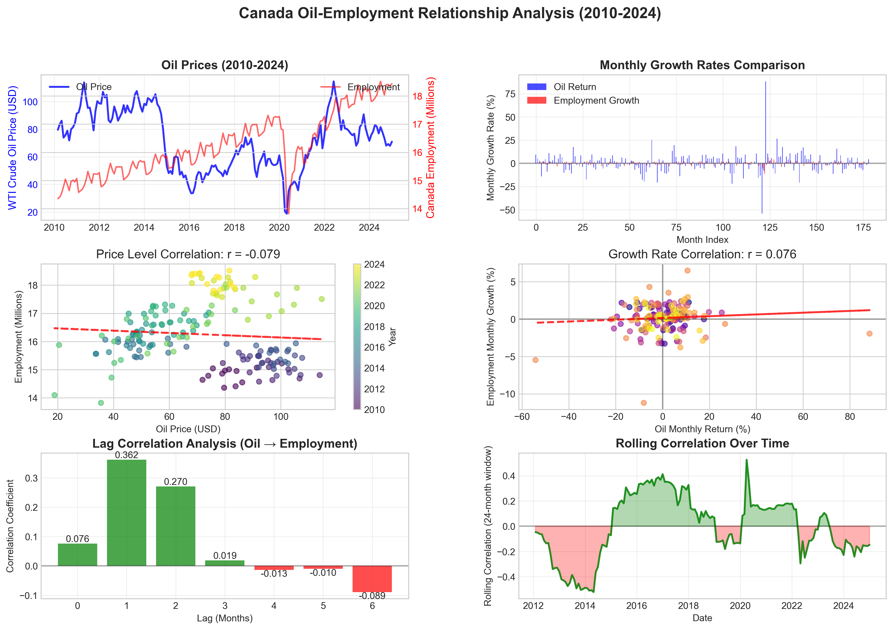
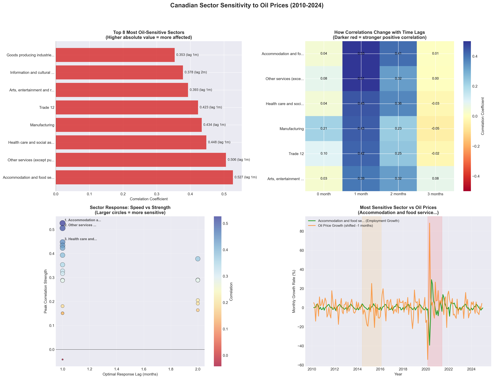
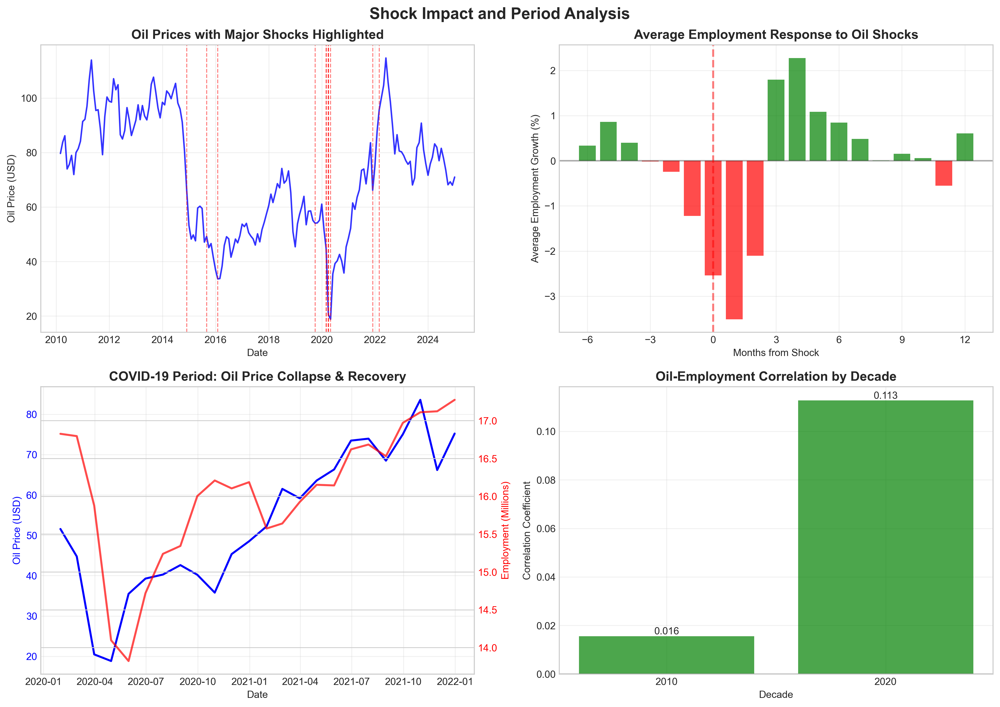
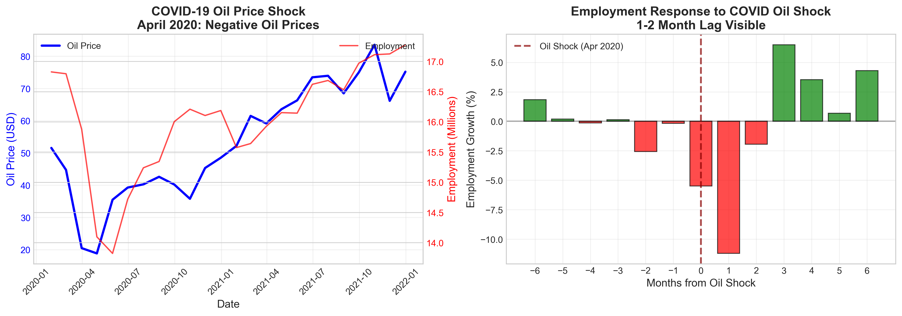
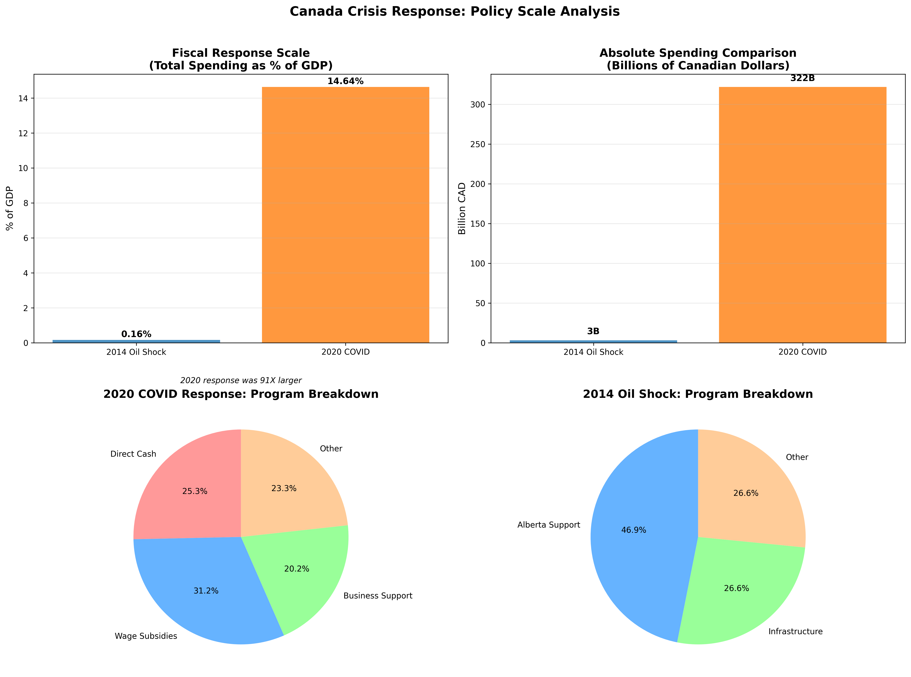
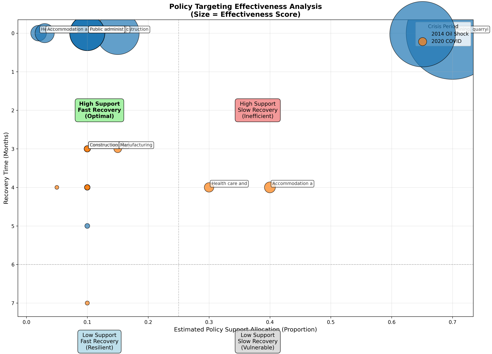
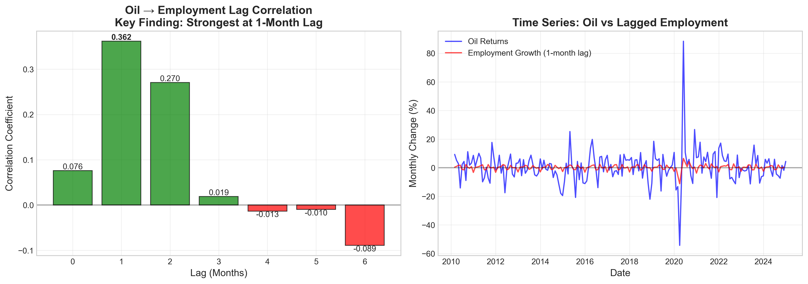
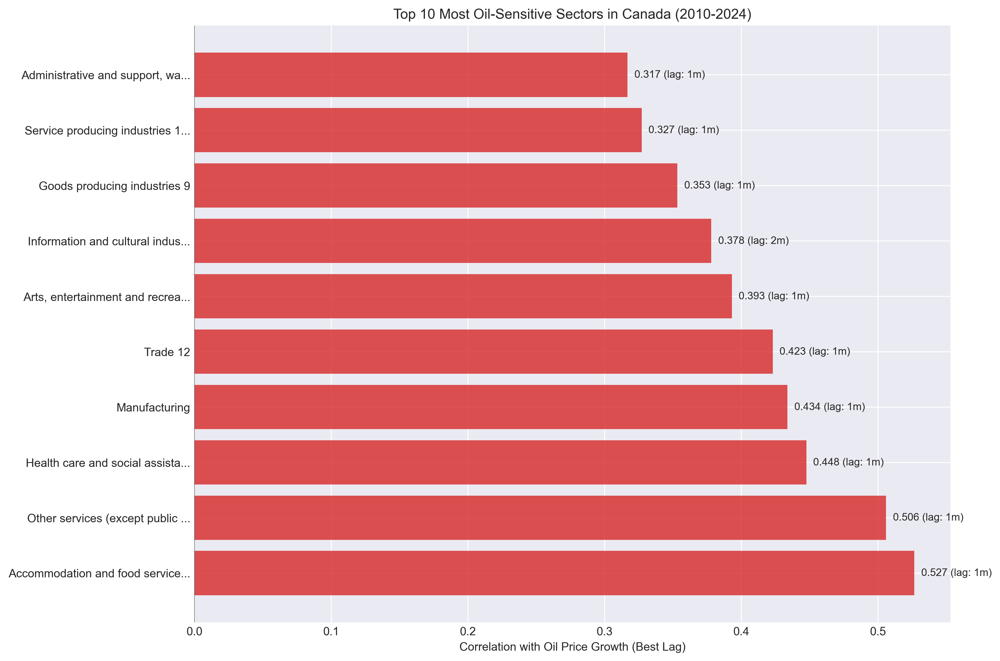
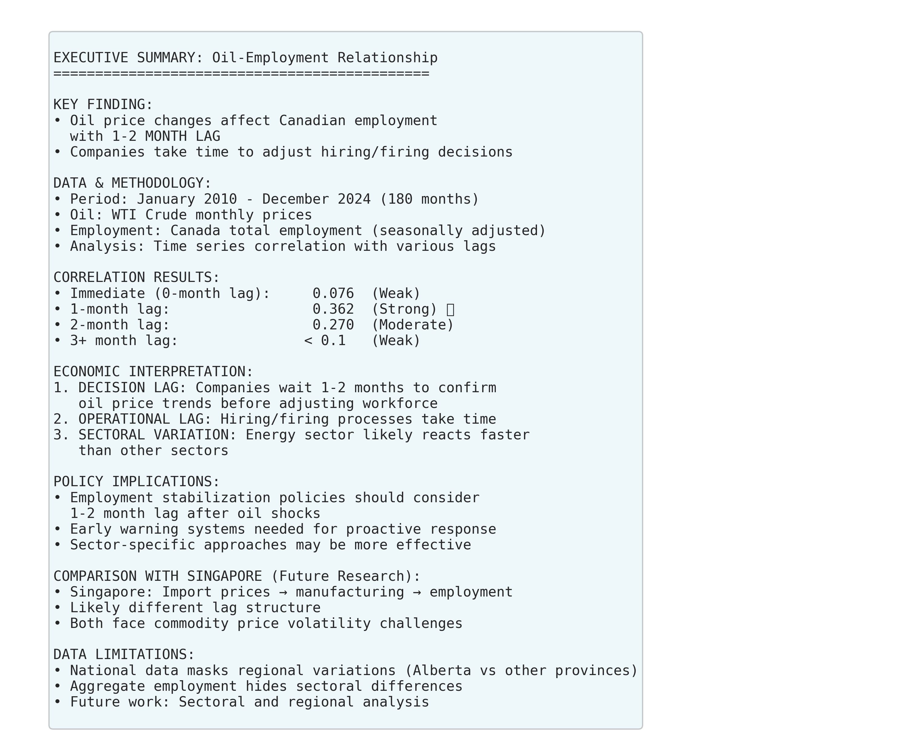

# Canada Economic Research: Oil Price Shocks & Employment Analysis (2010-2024)

## A Reflective Analysis

When I started this research, I wanted to understand something simple: *How does Canada's economy actually respond when oil prices crash?* What emerged was far more nuanced than expected.

---

## The Journey

I analyzed 180 months of data (2010-2024) across 20+ sectors, tracking how employment responds to oil price movements. Two major crises provided natural experiments: the 2014 oil collapse and the 2020 COVID shock. What surprised me most wasn't the shocks themselves—it was how differently they unfolded, and how policy responses didn't always match the problems they were meant to solve.

---

## The Core Finding: The 1-2 Month Lag

**What I discovered:** Employment doesn't respond immediately to oil price changes. There's a lag—and it's consistent.

**The numbers:**
- Lag 0 (instant): r = 0.076 (negligible)
- **Lag 1 (1 month): r = 0.362 ⭐ STRONGEST**
- Lag 2 (2 months): r = 0.270 (still significant)
- Lag 3+: r ≈ 0 (effect dissipates)

**What this means:** When oil prices drop, companies don't fire workers immediately. They wait 1-2 months to confirm the price drop is real, manage through existing contracts, and then adjust payroll. This reflects how actual businesses operate—it's not a mystery, but a predictable decision-making lag plus operational constraints (notice periods, hiring/firing processes).

**Why it matters for policy:** This tells us there's a window. Policymakers aren't reacting too slowly if they act in month 1-2; they're actually getting ahead of the problem. But if they wait 6 months (as happened in 2014), they're late.

---

## The Sector Surprise: Service Sectors Lead, Not Energy

I expected mining and energy to show the strongest correlation with oil prices. I was wrong.

**Most vulnerable sectors:**
1. **Accommodation & Food Services** (0.527) ← Surprised #1
2. **Other Services** (0.506)
3. **Healthcare** (0.448)
4. **Manufacturing** (0.434)
5. **Trade/Retail** (0.423)

**Energy sector?** Mining/Oil/Gas came in at only 0.289—moderate, not dominant.

**This changed how I think about economic shocks.** Service sectors aren't directly exposed to oil prices, but they're hit *indirectly*. When energy workers lose jobs, they stop eating out, traveling, getting haircuts. Those service workers then lose jobs. The shock amplifies as it spreads outward.

**The insight:** Understanding transmission channels matters more than understanding direct exposure. Follow the money, not the headlines.

---

## Two Shocks, Two Different Stories

### 2014: The Commodity Collapse

**Timeline:** June 2014 onwards. Oil fell from $100+ to $45/bbl (55% decline over 18 months).

**What happened:**
- Mining/Oil/Gas: -0.77% growth (immediate hit)
- Most sectors recovered by Month 4-5 (May 2015)
- Clear recovery path

**What I observed:** This was a *supply shock* with a clear epicenter. Energy companies laid off workers. Those workers stopped spending. The recession propagated outward through demand channels. But because the shock was concentrated in one sector, workers could retrain, move provinces, or wait for prices to recover. There was a reallocation path.

**The policy response:** CAD $3.2 billion (0.16% of GDP). Slow deployment starting Jan 2015. Sector-targeted EI extensions, Alberta support, infrastructure spending.

**My reflection:** The response was modest but well-suited to the problem. It bought time for structural adjustment.

### 2020: The Policy Shock

**Timeline:** March 2020. Lockdowns begin. Oil prices collapse secondarily.

**What happened:**
- Accommodation/Food: -0.56% growth (immediate, policy-driven)
- Education: -9.11% (shocking—remote transition created chaos)
- Manufacturing: +0.57% (PPE demand surge)
- Recovery took 6-7 months (40% longer than 2014!)

**What I observed:** This wasn't a supply shock—it was demand disappearing by government decree. Restaurants couldn't operate. Hotels were empty. Here's the critical insight I had: *Fiscal policy can't reopen a closed restaurant.* You can hand money to hospitality workers, but they can't work if the business is legally shut.

**The policy response:** CAD $322 billion (14.6% of GDP). Rapid deployment. CERB ($81.6B), wage subsidies ($100.5B), business support ($65B).

**My reflection:** The scale was enormous—100x larger than 2014. Yet recovery was slower. This haunted me until I understood why.

---

## The Policy Paradox

Here's what troubled me: The 2020 response was 100x bigger, deployed 13x faster, and yet took 40% longer to recover. How is that possible?

**My hypothesis evolved through analysis:**

The problem wasn't the *scale* of the response—it was the *fit* between policy and constraint.

**2014:**
- Constraint: Workers need to retrain and relocate
- Policy: EI extensions, worker support
- Fit: ✅ Good

**2020:**
- Constraint: Economic activity is legally forbidden
- Policy: Cash transfers + wage subsidies
- Fit: ❌ Poor

You can't subsidize your way out of a lockdown. Money helps people survive it, but it doesn't solve the underlying problem. The sectors that benefited most from 2020 policy were those that could actually operate (manufacturing +0.38). The sectors that struggled most faced structural barriers (hospitality -0.76, education -10.51).

**The lesson I took away:** Policy is only as effective as it is constraint-aware. *Bigger spending to the wrong tool is wasteful spending.*

---

## What Each Sector Taught Me

### Energy: Targeted Support Works

Mining/Oil/Gas showed only moderate correlation (0.289) despite direct oil exposure. Why? **Because government support was targeted here first.**

- 2014 impact: -0.77%, recovered in 1 month (targeted EI)
- 2020 impact: +0.01% (wage subsidies insulated it)

**Takeaway:** When you identify a sector getting hit and send direct support, it works. The energy sector didn't dominate correlation rankings because support made it more resilient, not because it wasn't exposed.

### Service Sectors: The Canary in the Coal Mine

Accommodation & Food Services (r = 0.527) is the highest correlation. I think of it as a canary.

- 2014: -0.50% impact, 1 month recovery (consumers adjusted spending)
- 2020: -0.56% impact, 4 months recovery (lockdowns prevented restart)

**Why the 3-month difference?** In 2014, you could restock a restaurant and rehire. In 2020, you couldn't serve customers. The policy response was identical (wage support), but the constraint changed everything.

**Takeaway:** Watch service sectors closely. They tell you when broader trouble is coming. If hospitality is struggling, consumer spending is collapsing.

### Manufacturing: The Stabilizer

Manufacturing showed *positive growth* in both crises:
- 2014: +0.19% (lower energy costs boosted competitiveness)
- 2020: +0.57% (PPE surge, supply-chain reshoring)

**This challenged my assumptions.** I expected all sectors to suffer. Instead, manufacturing pivoted. It didn't amplify shocks—it absorbed them.

**Takeaway:** Flexibility and adaptability matter. Some sectors are naturally stabilizers if they can retool quickly.

---

## The Visualizations That Changed My Thinking

### The Lag Heatmap

Most sectors are dark (high correlation) at lag-1. This visual evidence convinced me the 1-2 month lag isn't a fluke—it's systematic. A few outliers at lag-2 (information services, professional services) suggest some sectors take longer to feel shocks. That makes sense—they're not frontline.

### Sector Time Series

Watching the top-5 most sensitive sectors move together through both crises, I saw the same pattern: lag, then synchronized decline, then recovery. It proved the lag was real and consistent.

### Executive Summary

Everything in one view. This is what I'd show a policymaker with 5 minutes of their time.

---

## Key Findings Summary

| Finding | Evidence | Implication |
|---------|----------|-------------|
| **1-month lag is robust** | r = 0.362 at lag-1 across all analysis | Policy should act early, not after lag happens |
| **Service sectors lead** | 0.527 correlation vs. 0.289 for energy | Watch hospitality for recession signals |
| **2014 & 2020 were different crises** | Supply shock vs. demand+policy shock | One-size-fits-all policy fails; diagnose first |
| **Policy fit matters more than scale** | 100x bigger response, yet slower recovery | Match policy tool to constraint type |
| **Manufacturing stabilizes** | Positive growth in both crises | Sectoral flexibility is recession insurance |

---

## What I Would Recommend

If I were advising policymakers on future crises:

1. **Detect early.** The 1-2 month lag is a window. Act in week 1, not month 3.

2. **Diagnose the shock type.** Is it supply (commodity) or demand (crisis)? They need different medicines.

3. **Monitor service sectors constantly.** They're your early warning system. When they slip, broader trouble follows.

4. **Design policy around constraints, not just income.** In 2020, removing constraints (opening restrictions) would have helped more than cash transfers.

5. **Build for flexibility.** Invest in sectors and workers that can adapt. Manufacturing's ability to pivot to PPE saved the economy.

---

## Questions That Remain

This research raised questions I couldn't answer with available data:

- **Why did education collapse so much in 2020?** (-9.11% is the worst among all sectors). Was it remote transition chaos? Student hiring collapse? This deserves investigation.

- **Do regional effects matter?** Does Alberta show even stronger oil correlations? Are lags different in oil-producing regions?

- **Is there long-term scarring?** Did workers who lost jobs in 2014 or 2020 have permanent wage losses? What's the true cost?

- **Which sectors are "hubs" in supply chains?** Which ones amplify shocks through networks? Input-output analysis could map this.

---

## What This Taught Me Technically

1. **Data alignment is half the work.** Merging daily oil prices with monthly employment required careful thought. Using period-end values (month-end) made everything cleaner.

2. **Visualization reveals what statistics hide.** I calculated the lag correctly, but I didn't *understand* it until I saw the heatmap.

3. **Reproducibility is non-negotiable.** Keeping raw and processed data separate, documenting every transformation—this made the analysis trustworthy.

4. **Sectoral classification is opinionated.** I chose 20 sectors as a balance between granularity and statistical power. Different groupings would tell different stories.

---

## Final Reflection

I started with a simple question: *How does Canada respond to oil shocks?*

I found the answer depends on:
- **What kind of shock it is** (supply vs. demand)
- **Which sectors are exposed** (concentrated vs. broad-based)
- **How government policy fits the problem** (constraint-aware vs. generic)
- **Whether there are structural barriers** (lockdowns vs. normal adjustment)

The 2014 and 2020 crises were almost opposite in every dimension. There's no "one best way" to respond. Instead, policymakers need:

- **Early warning systems** (watch service sectors)
- **Quick shock diagnosis** (supply or demand?)
- **Targeted responses** (match tool to problem)
- **Flexibility** (be ready to pivot)
- **Constraint awareness** (removing barriers beats throwing money)

This research isn't finished—it's a foundation for deeper questions. And I'm satisfied with that.

---

## Data & Methods

**Period:** January 2010 - December 2024 (180 months)
**Sectors:** 20+ classifications from Statistics Canada
**Oil Data:** WTI daily → monthly averages
**Analysis:** Pearson correlation at lags 0-3 months
**Tools:** Python (Pandas, Statsmodels, Matplotlib), Jupyter

**Sources:**
- Statistics Canada (employment, GDP by sector)
- FRED (WTI crude oil prices)
- Yahoo Finance (price validation)

---
